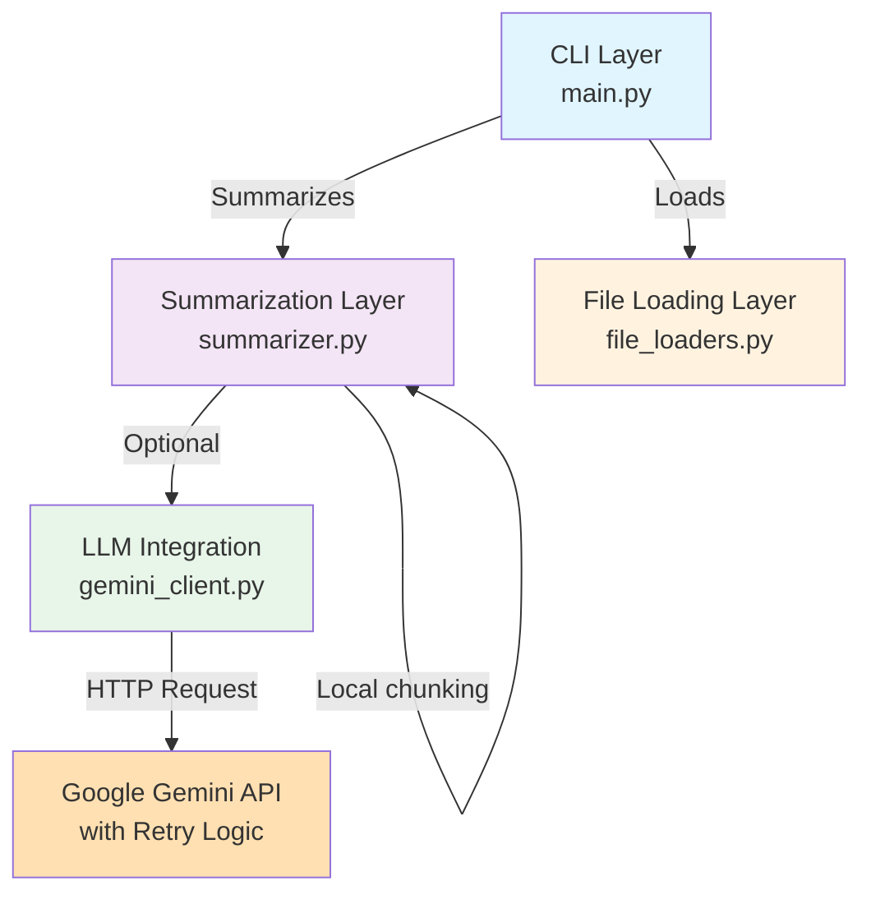
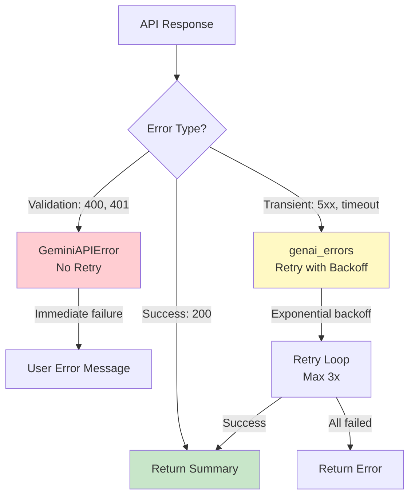
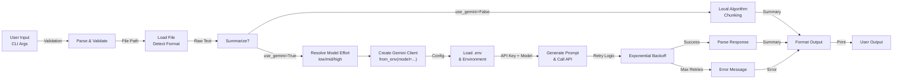

# Technical Documentation - Docalyzer

**Architecture, design decisions, and implementation details for developers**

##  Architecture Overview

Docalyzer follows a modular, layered architecture with clear separation of concerns:



### Layer Responsibilities

1. **CLI Layer** (`main.py`): Argument parsing, user interface, orchestration
2. **Summarization Layer** (`summarizer.py`): Algorithm selection, local vs. AI summarization
3. **LLM Integration** (`gemini_client.py`): API abstraction, error handling, retry logic
4. **Model Selection** (`model_enum.py`): User-facing Gemini effort presets mapped to concrete models
5. **Output Selection** (`outupt_enum.py`): User-facing Gemini output format selection
6. **File Loading** (`file_loaders.py`): Multi-format document parsing

##  Module Design

### 1. Main Module (`src/docalyzer/main.py`)

**Responsibility**: CLI entry point and orchestration

```python
def build_parser() -> argparse.ArgumentParser:
    """Create CLI argument parser"""
    
def main() -> int:
    """Parse args → Load file → Summarize → Print output"""
```

**CLI Arguments**:
- `path` (required): File to summarize
- `--sentences` (optional, default 5): Gemini summary length, valid only with `--gemini`
- `--gemini` (optional flag): Use AI summarization
- `--model` (optional, default `mid`): Gemini effort level (`low`, `mid`, `high`), valid only with `--gemini`
- `--output` (optional, default `txt`): Gemini output format (`txt`, `md`, `json`), valid only with `--gemini`

**Return codes**:
- `0`: Success
- `1`: File not found or processing error

**Design Decision**: Simple, synchronous CLI using `argparse` for clarity and standard library compatibility.

**Model effort mapping**:
- `low` → `gemini-2.5-flash-lite`
- `mid` → `gemini-2.5-flash`
- `high` → `gemini-2.5-pro`

**Validation rules**:
- `--sentences` requires `--gemini`
- `--model` requires `--gemini`
- `--output` requires `--gemini`
- `--sentences` must be between `1` and `250`

### 2. Summarizer Module (`src/docalyzer/summarizer.py`)

**Responsibility**: Summarization algorithm selection and execution

```python
def summarize_text(text: str, max_sentences: int = 5) -> str:
    """Extract sentences from text, return first N"""
    
def summarize_long_text(
    text: str,
    model_kind: ModelEnum | None = None,
    chunk_size: int = 2000,
    max_sentences: int = 5,
    use_gemini: bool = False,
    output_format: OutputEnum = OutputEnum.PLAIN,
) -> str:
    """Route to Gemini API or local chunking"""
```

**Local Summarization Algorithm**:
1. Split text into fixed-size chunks (2000 chars)
2. Extract sentences from each chunk
3. Return first N sentences per chunk
4. Join chunks with double newline

**Tradeoff: Simplicity vs. Quality**
-  Pros: Fast, no dependencies, works offline
-  Cons: Simple sentence extraction, doesn't understand context

**Gemini Integration**:
- Delegates to `GeminiClient` for API calls
- Resolves user-facing effort levels through `MODEL_MAP`
- Passes `output_format` through to the Gemini request builder
- Catches `GeminiAPIError` and `ValueError`
- Returns error string instead of raising (graceful degradation)

**Model and output selection flow**:
1. CLI parses `--model` into `ModelEnum`
2. CLI parses `--output` into `OutputEnum`
3. `summarize_long_text()` converts the selected model enum into a concrete Gemini model name
4. `GeminiClient.from_env(model=...)` receives the resolved model
5. `GeminiClient.summarize(..., output_format=...)` receives the selected output format
6. If no CLI effort is provided, the summarizer falls back to `DEFAULT_MODEL`
7. If no CLI output is provided, the system defaults to `OutputEnum.PLAIN`

### 3. Model Selection Module (`src/docalyzer/model_enum.py`)

**Responsibility**: Keep CLI model selection stable while allowing concrete Gemini models to change internally

```python
class ModelEnum(StrEnum):
    LOW = "low"
    MID = "mid"
    HIGH = "high"

MODEL_MAP = {
    ModelEnum.LOW: "gemini-2.5-flash-lite",
    ModelEnum.MID: "gemini-2.5-flash",
    ModelEnum.HIGH: "gemini-2.5-pro",
}
```

**Design Decision**: Introduce a thin enum layer instead of exposing raw Gemini model IDs directly on the CLI.
- Pros: Stable UX, easier docs, safer future model swaps
- Cons: One more mapping layer to maintain

### 4. Output Selection Module (`src/docalyzer/outupt_enum.py`)

**Responsibility**: Define user-facing output format values accepted by the CLI and Gemini integration

```python
class OutputEnum(StrEnum):
    PLAIN = "txt"
    MARKDOWN = "md"
    JSON = "json"
```

**Design Decision**: Use a small `StrEnum` so CLI parsing remains strict and the rest of the code can work with explicit output variants.
- Pros: Clear contract, easy validation, less stringly-typed branching
- Cons: Adds one more enum module to maintain

### 5. Gemini Client Module (`src/docalyzer/gemini_client.py`)

**Responsibility**: API abstraction, error handling, retry logic

```python
class GeminiClient:
    def __init__(
        self,
        api_key: str,
        model: str = "gemini-2.5-flash",
        timeout: int = 30,
        max_retries: int = 3,
        initial_retry_delay: float = 1.0
    )
    
    @classmethod
    def from_env(
        cls,
        model: str = "gemini-2.5-flash",
        env_path: str | Path | None = None,
        max_retries: int = 3
    ) -> "GeminiClient"
    
    def summarize(
        self,
        text: str,
        max_sentences: int = 5,
        output_format: OutputEnum = OutputEnum.PLAIN,
    ) -> str
```

**Key Features**:

#### Output-aware prompt generation
- Builds different Gemini prompts for `txt`, `md`, and `json`
- Plain text prompts request readable spacing and non-Markdown output
- Markdown prompts request headers, bullet points, and a professional structure
- JSON prompts request a strict response shape with snake_case keys
- Unknown output values fall back defensively to plain text prompt instructions

#### Environment Loading
- Reads from `.env` file or `os.environ`
- Supports `GEMINI_API_KEY`, `GEMINI_MODEL`, `GEMINI_MAX_RETRIES`
- Custom implementation if `python-dotenv` not available
- Falls back gracefully with clear error messages
- Allows the caller to override the environment model at runtime

#### Error Classification



**Retry Strategy**:
- **Transient errors** (ServerError, ClientError, APIError): Automatic retry
- **Validation errors** (400, 401): Immediate failure
- **Exponential backoff**: Delay = `initial_retry_delay * 2^attempt`
  - Attempt 0: 1.0 second
  - Attempt 1: 2.0 seconds
  - Attempt 2: 4.0 seconds

**Logging**:
- **DEBUG**: Initialization, API calls, retry attempts
- **WARNING**: Transient errors before retry
- **ERROR**: Final failure or validation errors

#### JSON response contract

When `--output json` is selected, the prompt asks Gemini to return only valid JSON using this logical structure:

```json
{
  "document_title": "",
  "short_description": "",
  "short_summary": "",
  "full_summary": ""
}
```

Requested rules:
- all keys must use `snake_case`
- `document_title` should be included if applicable
- `short_description` should contain 3 sentences
- `short_summary` should contain 2-3 sentences
- `full_summary` should contain at most the user-provided sentence limit

#### Design Tradeoffs

| Decision | Rationale | Tradeoff |
|----------|-----------|----------|
| Class abstraction | Future model flexibility | Extra complexity |
| Runtime model override | CLI effort selection should beat `.env` defaults | Slightly more config flow to reason about |
| Custom error handling | Distinguish retry-able errors | More code |
| Exponential backoff | Reduce API server load | Longer wait on failures |
| selective retries | Don't mask validation bugs | Must classify errors |
| Logging integration | Production debugging | Performance overhead (minimal) |

### 6. File Loaders Module (`src/docalyzer/file_loaders.py`)

**Responsibility**: Multi-format document parsing

**Supported Formats** (18+ types):

| Category | Extensions |
|----------|-----------|
| Documents | `.pdf`, `.docx`, `.xlsx`, `.pptx` |
| Markup | `.html`, `.xml`, `.md`, `.json`, `.yaml`, `.yml` |
| Data | `.csv` |
| Code | `.py`, `.js`, `.ts`, `.go`, `.java`, `.c`, `.cpp` |
| Text | `.txt` |

**Loader Pattern**:
```python
@register_loader((".pdf",))
def load_pdf(path: Path) -> str:
    # Extract text from PDF
```

**Error Handling**:
- `UnsupportedFileTypeError`: Unknown extension
- `MissingDependencyError`: Optional library not installed
- `FileLoadError`: Base exception for all file loading errors

**Design Decision**: Decorator pattern for extensibility
-  Easy to add new formats
-  Dynamic registration
-  Less explicit than explicit function mapping

##  Data Flow Diagram



##  Testing Strategy

### Test Coverage

```
tests/
├── test_file_loaders.py
├── test_gemini_client.py
├── test_main.py
├── test_model_enum.py
└── test_summarizer.py
```

### Testing Approach

**Current coverage areas**:
- File loader behavior for core text-based formats and error paths
- Gemini client environment loading, retry logic, and failure handling
- CLI argument validation for `--gemini`, `--sentences`, and `--model`
- Model effort mapping stability
- Summarizer routing for local vs. Gemini execution

**Mocking Strategy**:
```python
@patch('google.genai.Client')
def test_retry_logic(mock_client):
    # Mock progressive failures
    mock_instance.generate_content.side_effect = [
        RuntimeError("Transient error"),
        RuntimeError("Transient error"),
        MagicMock(text="Summary..."),  # Success on 3rd attempt
    ]
```

**Why No Live API Tests**:
-  Faster (no network latency)
-  Consistent (no API rate limits)
-  Cost-free (no API charges)
-  Reproducible (no external dependencies)

##  Error Handling Patterns

### Pattern 1: Validation Errors (No Retry)

```python
if not api_key:
    raise GeminiAPIError("GEMINI_API_KEY not set")
    # Client catches as GeminiAPIError → no retry
```

### Pattern 2: Transient Errors (Retry)

```python
try:
    response = client.generate_content(prompt)
except (genai_errors.ServerError, genai_errors.APIError) as e:
    # Caught by retry loop → exponential backoff
    raise RuntimeError(str(e))
```

### Pattern 3: Graceful Degradation

```python
def summarize_long_text(..., use_gemini=False):
    if use_gemini:
        try:
            return GeminiClient.from_env(model=resolved_model).summarize(text)
        except (GeminiAPIError, ValueError) as error:
            return f"Gemini failed: {error}"  # Return error, don't crash
```

##  Security Considerations

### API Key Management

```env
# .gitignored - never commit
GEMINI_API_KEY=sk_live_xxxxxxxxxxxxx
```

**Best Practices**:
1.  Use `.env` file, not hardcoded values
2.  Add `.env` to `.gitignore`
3.  Use environment-specific keys in production
4.  Rotate keys regularly
5.  Consider secret management tools (GitHub Secrets, HashiCorp Vault)

### Input Validation

-  File paths validated before loading
-  Text size limits prevent memory exhaustion
-  Timeout prevents hanging requests

##  Performance Characteristics

| Operation | Time | Notes |
|-----------|------|-------|
| Local text load | ~5ms | File I/O only |
| PDF parsing | ~50-200ms | Depends on size |
| Local summarization | ~20-100ms | Regex-based, fast |
| Gemini API call | ~1-3s | Network + processing |
| Retry with backoff | +1-7s | 3 retries = 1+2+4 seconds |

### Optimization Opportunities

1. **Caching**: Cache summaries by file hash
2. **Async I/O**: Use `asyncio` for concurrent requests
3. **Streaming**: Stream large document parsing
4. **Batch API**: Process multiple files in one API call

##  Future Enhancements

- [x] `--model` CLI flag for runtime Gemini model-effort selection
- [x] GitHub Actions CI pipeline
- [x] `--output` flag (JSON, md, plain text)
- [ ] `--tofile` flag (to export summary to a separate user-indicated file) (JSON, md, txt) 

##  Development Workflow

### Adding a New File Format

1. Install parser library: `pip install library-name`
2. Add to `requirements.txt`
3. Import in `file_loaders.py` with try/except
4. Create loader function with `@register_loader` decorator:
   ```python
   @register_loader((".ext",))
   def load_ext(path: Path) -> str:
       # Extract text
       return text
   ```
5. Add test case
6. Update README.md with format table

### Adding a New Summarization Model

1. Create abstraction interface in new file `src/docalyzer/llm_client.py`
2. Implement `BaseLLMClient` with abstract `summarize()` method
3. Make `GeminiClient` inherit from `BaseLLMClient`
4. Add new provider client class (e.g., `OpenAIClient`)
5. Update `summarizer.py` to accept configurable provider
6. Add tests for new provider

### Debugging

**Enable verbose logging**:
```python
import logging
logging.basicConfig(level=logging.DEBUG)

docalyzer document.pdf --gemini
```

**Common Issues**:
- **Missing dependency**: `pip install -r requirements.txt`
- **API key error**: Check `.env` file and `GEMINI_API_KEY` value
- **Rate limiting**: Increase `GEMINI_MAX_RETRIES` in `.env`

##  Dependencies & Rationale

| Dependency | Version | Purpose | Rationale |
|-----------|---------|---------|-----------|
| `google-genai` | >=0.3.0 | Official Gemini SDK | Official, well-maintained, type-hinted |
| `python-dotenv` | >=1.0.0 | `.env` file loading | Standard for Python projects |
| `python-docx` | >=0.8.11 | Word documents | De facto standard, active maintenance |
| `openpyxl` | >=3.1.2 | Excel spreadsheets | Industry standard, Pandas-compatible |
| `python-pptx` | >=0.6.21 | PowerPoint files | Most complete PPTX library |
| `PyPDF2` | >=3.0.0 | PDF parsing | Lightweight, pure Python |
| `beautifulsoup4` | >=4.12.2 | HTML parsing | Flexible, Pythonic, widely used |
| `pyyaml` | >=6.0 | YAML parsing | Official YAML library |

**Not Used**:
-  `pytest`: `unittest` is sufficient for small projects
-  `click`: `argparse` is standard library
-  `pydantic`: Over-engineered for current config needs
-  `asyncio`: Synchronous API is simpler for CLI tool

##  Code Quality Standards

### Type Hints
- All functions have type hints
- Used by Pylance for IDE support
- Enables runtime type checking if desired

### Logging
- DEBUG: Initialization, API calls, state changes
- WARNING: Transient errors, retries
- ERROR: Critical failures, validation errors
- No print() statements in production code

### Error Messages
- **User-facing**: Clear, actionable, non-technical
- **Log-facing**: Detailed, includes context, full tracebacks

### Testing
- 100% coverage of error handling paths
- No network calls in tests (mocked)
- Deterministic and reproducible
- Fast execution (<2 seconds total)

---

##  Related Documentation

- **[README.md](README.md)** - User guide, installation, and usage examples

---

**Version**: 1.0.0 | **Last Updated**: 2026-06-24 | **Audience**: Python developers and contributors
